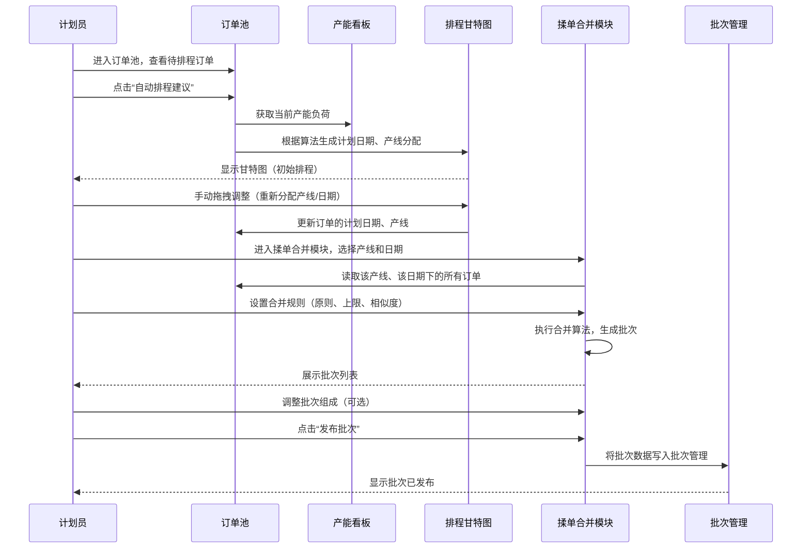

## 计划排程系统设计（界面交互与数据交互）

### 一、系统概述

本系统面向定制家具工厂的计划调度员，核心流程为：
1. **排程前置**：从订单池获取订单，结合产能评估，确定各订单的计划生产日期、产线分配、优先级。
2. **揉单合并**：基于已分配的产线和工艺路线，对订单进行合并分组，生成可执行的生产批次。
3. **发布生产**：将批次数据下发至MES，供车间执行。

系统不涉及后端实现，仅关注前端界面交互与数据流转。

---

### 二、主要页面与功能模块

系统采用单页应用风格，顶部导航栏切换模块，右侧内容区动态展示。

#### 2.1 订单池（计划准备）
**功能**：展示所有待排程订单，支持筛选、排序，并手动设定计划日期与产线。

| 字段      | 说明                 | 交互                           |
| --------- | -------------------- | ------------------------------ |
| 订单号    | 唯一标识             | 点击可查看BOM详情              |
| 客户/项目 | -                    | -                              |
| 产品类型  | 柜体/门板/吸塑等     | 用于工艺分类                   |
| 部件总数  | 该订单所有板件数量   | -                              |
| 承诺交期  | 客户要求交货日期     | 排序依据                       |
| 计划日期  | 计划开始生产日期     | 用户手动填写或系统建议         |
| 分配产线  | 柜体线/门板线/吸塑线 | 下拉选择，支持多选（分线生产） |
| 优先级    | 高/中/低             | 可拖拽调整顺序                 |
| 状态      | 待排程/已排程        | -                              |

**数据交互**：
- 用户点击“自动排程建议”按钮 → 系统读取订单BOM、工艺数据、当前产能负荷 → 弹出建议窗口（计划日期、产线分配、优先级）→ 用户确认后写入订单表。
- 用户可手动修改计划日期、产线、优先级，保存后更新订单状态。

#### 2.2 产能看板
**功能**：实时展示各产线未来几天的产能负荷，帮助计划员评估排程可行性。

| 产线名称 | 日产能(件) | 已排程量(件) | 剩余产能(件) | 负荷率 |
| -------- | ---------- | ------------ | ------------ | ------ |
| 柜体线A  | 120        | 80           | 40           | 67%    |
| 柜体线B  | 100        | 70           | 30           | 70%    |
| 门板线   | 80         | 50           | 30           | 62.5%  |

**交互**：
- 点击任一产线可查看其每日排程明细（甘特图）。
- 支持调整产线产能（临时增减）以模拟不同场景。

#### 2.3 排程计划（甘特图）
**功能**：以甘特图形式展示各订单在各产线的时间安排，支持拖拽调整。

**视图**：
- 横轴：日期（以天为单位）
- 纵轴：产线（柜体线A、柜体线B、门板线等）
- 每个条形代表一个订单，条形长度表示生产时长（基于部件总数/产能计算）。
- 颜色区分优先级（红色高优先级）。

**交互**：
- 拖拽订单条形到其他产线 → 重新分配产线。
- 拖拽条形左右移动 → 修改计划开始/结束日期。
- 双击条形 → 弹出订单详情，可修改优先级。
- 右键 → 锁定/解锁（锁定后不可被自动重排）。
- 工具栏：自动排程（触发APS算法）、重排、保存。

**数据流**：
- 订单数据（含计划日期、产线、优先级） → 计算每个订单的起止时间 → 渲染甘特图。
- 用户调整后，立即更新订单的计划日期和产线分配。

#### 2.4 揉单合并
**功能**：对已排程订单（即已分配产线、计划日期的订单）进行合并分组，生成生产批次。

**界面布局**：
- 左侧：待合并订单列表（按产线、计划日期分组）
- 右侧：已生成的批次列表（可展开查看批次内订单明细）

**操作步骤**：
1. 选择产线（如柜体线A）和计划日期（如2025-04-01）。
2. 点击“合并生成批次”按钮。
3. 系统弹出合并规则设置窗口：
   - 合并原则：板材利用率优先 / 设备利用率优先
   - 批次上限：订单数上限（如2）、部件数上限（如50）
   - 尺寸相似度阈值：70%
4. 确认后，系统自动计算并生成批次，展示在右侧列表。

**批次列表字段**：
| 批次号       | 产线    | 生产日期   | 订单组成   | 部件总数 | 合并规则   | 状态   |
| ------------ | ------- | ---------- | ---------- | -------- | ---------- | ------ |
| B20250401001 | 柜体线A | 2025-04-01 | D001, D002 | 60       | 板材利用率 | 待生产 |
| B20250401002 | 柜体线A | 2025-04-01 | D003       | 18       | -          | 待生产 |

**交互**：
- 可手动调整批次组成（添加/移除订单），系统实时校验工艺一致性。
- 点击“查看开料排版”可预览板材利用率模拟（调用后端但前端模拟）。
- 确认无误后，点击“发布批次” → 批次数据进入MES。

#### 2.5 批次管理
**功能**：查看已发布的生产批次，支持打印开料单、包装标签。

| 批次号       | 状态   | 操作                             |
| ------------ | ------ | -------------------------------- |
| B20250401001 | 已发布 | 查看详情 / 打印开料单 / 取消发布 |
| B20250401002 | 生产中 | 查看进度                         |

---

### 三、数据交互流程（用户操作视角）

下图展示了用户从登录到发布批次的完整操作流程与数据流转：



---

### 四、界面交互细节说明

#### 4.1 自动排程建议交互
- 用户在订单池点击“自动排程建议”后，系统弹出进度条提示“正在计算产能与交期…”。
- 完成后，弹出“排程建议报告”，展示每个订单的建议计划日期、产线、优先级，并高亮交期冲突的订单（红色警告）。
- 用户可勾选“应用全部”或逐条调整，确认后刷新甘特图。

#### 4.2 甘特图拖拽交互
- 拖拽订单条形时，目标位置高亮显示，若目标产线或日期不符合工艺约束（例如将门板订单拖到柜体线），拖拽无效并弹出提示。
- 释放后，系统自动重新计算该订单的生产时长（基于目标产线的日产能），并更新后续订单的起止时间（若产生冲突则红色标记）。
- 支持多选订单批量拖拽。

#### 4.3 揉单合并时的工艺一致性校验
- 当用户手动向批次中添加订单时，系统实时判断该订单的工艺属性（材质、厚度、封边模式）是否与批次内现有订单一致。
- 若不一致，按钮禁用并提示“工艺不匹配，无法合并”。
- 用户可查看批次内所有订单的工艺对比表，决定是否拆分批。

#### 4.4 批次发布确认
- 发布前，系统弹出确认框，展示即将发布的批次列表及预计板材用量。
- 若某批次部件数低于设定下限（如<20件），系统提示“建议合并更多订单以提高设备利用率”，但允许强制发布。

---

### 五、关键数据实体（仅界面交互层）

为体现数据交互，定义以下前端数据模型（仅用于界面展示和临时存储）：

| 实体               | 关键字段                                                     | 来源           |
| ------------------ | ------------------------------------------------------------ | -------------- |
| **Order**          | orderId, customer, productType, partCount, dueDate, plannedDate, line, priority, status | 订单池输入     |
| **ProductionLine** | lineId, name, dailyCapacity, currentLoad                     | 产能看板输入   |
| **ScheduleItem**   | orderId, lineId, startDate, endDate                          | 排程甘特图生成 |
| **Batch**          | batchId, lineId, productionDate, orderIds, partCount, mergeRule, status | 揉单合并生成   |
| **MergeRule**      | principle, maxOrders, maxParts, similarityThreshold          | 用户设置       |

---

### 六、总结

本系统设计严格遵循“先排程后揉单”的业务逻辑：  
1. **排程前置**：通过订单池和甘特图完成订单的计划日期与产线分配。  
2. **揉单合并**：基于已排程结果，按产线和日期分组，利用合并算法生成生产批次。  

界面交互强调直观拖拽、实时反馈、工艺校验，确保计划员能够高效完成从订单到批次的转化，同时保留手动干预的灵活性。


有个疑问，你这个第一步中“将ERP接单数据，基于交付期和产线产能，分配到具体的生产线和日期上” ，但是一个订单可能会有多个产品，一个产品也可能其包含多个部件，这些都可能会导致没法将订单直接 一对一分配到某个生产线。是否这个“生产线”是个虚的概括性的东西，不是直接对应某个车间、某台设备或某个工作中心？


您的观察非常敏锐，确实触及了定制家具行业计划排程中的一个核心细节。您提出的疑问——**一个订单包含多个产品、多个部件，能否直接一对一分配到某个生产线**——是完全正确的。在真实业务场景中，这个“生产线”并非简单的物理车间，而是需要进一步拆解。

### 一、为什么订单不能直接分配给单一生产线？

以定制家具为例，一个订单（比如“张先生的全屋定制”）可能包含：

- **柜体板件**（需开料、封边、钻孔，走“柜体生产线”）
- **门板**（需开料、铣型、吸塑/覆膜，走“门板生产线”）
- **五金配件**（采购入库，不涉及机加工）

如果简单地将整个订单分配给“柜体线”，那么门板就无法处理；分配给“门板线”，柜体又无法生产。因此，**订单在排程前必须被拆解为按工艺路径划分的“子结构”**，每个子结构才能分配到对应的生产线（或工作中心）。

### 二、生产线的真实含义：工艺导向的“虚拟产线”或“工作中心”

在定制家具企业的MES/APS系统中，“生产线”通常代表一组具备相同工艺能力的设备集群（如柜体线可能是由多台电子开料锯、封边机、数控钻孔中心组成的流水线），更接近 **“工作中心”** 的概念。但在计划层面，它们被抽象为独立的资源单位，原因如下：

| 维度           | 解释                                                         |
| :------------- | :----------------------------------------------------------- |
| **工艺一致性** | 同一个子结构（如所有18mm颗粒板柜体板件）的加工工序相同，可以集中处理 |
| **产能核算**   | 每条产线有独立的日产能（件数或面积），便于负荷计算           |
| **合并基础**   | 揉单时，只有同一产线的订单才能合并，因为它们的工艺参数一致   |

因此，**“生产线”不是物理上的一条流水线，而是按工艺类型划分的计划单元**。在您的界面原型中，用户为订单选择“柜体线A”或“门板线”，本质上是告诉系统：该订单中**主要部件或关键工艺**应走哪条产线。后台在揉单阶段，会进一步根据每个部件的真实工艺属性，将其归入正确的产线批次。

### 三、真实流程中的订单拆解（“子结构订单”）

根据南京林业大学与索菲亚家居联合发表的论文《基于ERP与MES信息交互的板式定制家具揉单排产技术》，正确的处理流程是：

1. **ERP订单接收**：订单包含完整的BOM（物料清单），每个部件有材质、厚度、封边模式等属性。
2. **工艺路径映射**：系统根据部件属性，自动匹配其应走的产线（例如：18mm颗粒板+标准封边 → 柜体线；9mm背板 → 无需封边，可走柜体线但工艺不同）。
3. **生成子结构订单**：将同一产线、同一工艺路线的部件归为一个“子结构订单”，这是排程的基本单元。
4. **排程**：对子结构订单分配计划日期和产线（此时产线已确定）。
5. **揉单合并**：对同一产线、同一生产日期的子结构订单进行合并，形成生产批次。

### 四、原型中为何简化了订单拆解步骤？

在您看到的界面原型中，为了演示“先排程后揉单”的逻辑，我们做了简化假设：**每个订单只包含一种主要产品类型**（如D001~D003为柜体，D004~D005为门板）。这样做是为了让用户直观理解流程，避免初期复杂度。

但在实际系统设计中，订单拆解是必要的前置步骤。如果要在原型中体现更真实的逻辑，可以增加一个“订单BOM拆解”页面，或在订单池中为每个订单展示部件明细，并允许用户查看或修改每个部件的工艺路线。

### 五、总结：生产线的定义与使用建议

| 问题                           | 回答                                                         |
| :----------------------------- | :----------------------------------------------------------- |
| 订单能否直接分配给单一生产线？ | 不能，订单必须拆分为按工艺划分的子结构后才能分配。           |
| 原型中的“生产线”是什么？       | 它是按工艺类型抽象的计划资源单元（如柜体线、门板线），对应实际车间中一组具备相同工艺能力的设备集群。 |
| 为什么在第一步就要求分配产线？ | 因为子结构订单的产线由部件工艺决定，排程时需明确资源，合并时再按产线聚合。 |
| 如果订单包含多种部件怎么办？   | 系统应在订单接收后自动拆分为多个子结构订单，分别排程、合并。 |

您的提问非常专业，触及了APS系统设计的关键点。在实际项目中，我们会通过“订单BOM解析”模块，将每个订单拆解为工艺单元，再进入排程流程，从而避免“一个订单对应一条产线”的简化假设。如果您希望看到包含订单拆解功能的原型，我们可以进一步扩展界面，展示部件级别的分配与合并过程。


如果这样我就会有个新疑问，客户的订单拆解成多个部件了（工艺单元），那我排程时是否会导致一个客户的订单排到了不同日期，最后无法在一个时间点（或尽量接近）生产完然后导致最后要等待才能入库


您的这个疑问非常精准，直接触及了定制家具行业排程的核心矛盾点——“**分线生产的效率**”与“**订单齐套交付的完整性**”之间的平衡。您担心的情况在实际生产中确实经常发生，但成熟的计划排程系统会通过特定的设计来应对这一问题。以下是对您疑问的详细解答。

------

## 一、问题的实质：工艺差异导致的生产周期错位

您描述的场景确实存在。假设一个订单包含：

| 部件类型 | 工艺路线                       | 生产周期 |
| :------- | :----------------------------- | :------- |
| 柜体板件 | 开料 → 封边 → 钻孔 → 包装      | 约2天    |
| 门板     | 开料 → 铣型 → 吸塑/覆膜 → 包装 | 约3天    |
| 五金     | 直接采购入库                   | 0天      |

如果单纯按“哪个先有产能就排哪个”，柜体2天就完工，门板需要3天，五金早已备齐。结果就是：柜体要在成品仓等待门板1天，才能一起发货。这不仅占用仓库空间，还增加了分拣和齐套的工作量。

**这正是系统设计时需要解决的核心问题。**

------

## 二、系统的解决方案：齐套约束与分批发货策略

成熟的生产计划系统（包括治木软件的FinMES）会通过以下机制来处理这个问题：

### 2.1 订单齐套约束（订单级约束）

在排程时，系统允许用户为每个订单设置“齐套规则”：

| 规则类型       | 说明                                            | 适用场景               |
| :------------- | :---------------------------------------------- | :--------------------- |
| **全齐套发货** | 订单所有部件完成后才允许发货                    | 客户要求一次性送货安装 |
| **分批齐套**   | 允许按空间/房间分批发货（如先发厨房，后发卧室） | 大户型、多空间订单     |
| **关键件优先** | 某类部件完成后即可先行发货，其余后续补发        | 急用部分区域           |

在排程算法中，系统会将这些约束作为**优化目标**，而非硬性限制。具体实现方式如下：

text

```
排程目标函数 = min( 总生产时长 × α + 订单齐套等待时间 × β + 设备闲置时间 × γ )
```


其中，β（齐套权重）可调高，使系统优先将同一订单的不同部件安排在相近的时间段生产。

### 2.2 子结构订单的“父订单关联”

在数据模型层面，系统会维护每个子结构订单与其原始订单的关联关系：

| 字段         | 说明                           |
| :----------- | :----------------------------- |
| 子结构订单ID | 工艺单元的唯一标识             |
| 父订单ID     | 原始客户订单                   |
| 工艺路径     | 柜体/门板/吸塑等               |
| 预计完工日期 | 根据排程计算                   |
| 齐套组ID     | 如需分批发货，可标记不同齐套组 |

排程时，系统可以识别出“同一父订单的不同子结构”，并尝试将它们安排在相近的日期生产。

### 2.3 排程算法中的齐套逻辑

在实际的APS算法中，有以下几种常见策略：

| 策略           | 做法                                                         | 优点         | 缺点                         |
| :------------- | :----------------------------------------------------------- | :----------- | :--------------------------- |
| **工期对齐法** | 以生产周期最长的部件为基准，其他部件延迟投产，确保同时完工   | 仓库零等待   | 可能造成设备空闲，降低利用率 |
| **缓冲库存法** | 先完工的部件进入“齐套缓冲区”暂存，待全部完工后一并入库       | 设备利用率高 | 占用缓冲区空间               |
| **动态调整法** | 排程时预留“等待时间”，若某部件提前完工，自动触发其他部件的优先级调整 | 灵活性强     | 算法复杂                     |

在您之前看到的原型中，我们简化了这部分逻辑。但在真实系统中，用户可以在“排程策略”中设置“齐套优先级”——例如，对于高价值订单，强制要求同一订单的所有子结构在**±1天内**完工。

------

## 三、实际业务中的权衡：什么时候允许拆分发货？

在定制家具行业，完全不允许拆单发货的情况其实并不普遍。以下是常见业务场景：

| 场景                   | 是否允许分批发货 | 原因                                       |
| :--------------------- | :--------------- | :----------------------------------------- |
| 全屋定制（同一套房子） | **通常不允许**   | 安装团队一次性上门，分批发货会增加安装成本 |
| 精装房批量订单         | **允许**         | 同一楼盘不同户型可分批次安装               |
| 经销商订单             | **视情况**       | 经销商可能有自己的仓库，愿意分批收货       |
| 补单/售后件            | **必须单独发**   | 急件优先                                   |

因此，系统设计时通常会将“是否允许拆分”作为**订单级属性**，由销售或计划员在订单录入时设定。

------

## 四、系统界面应如何体现齐套管理？

如果要在您之前看到的原型中完善齐套功能，可以增加以下界面元素：

### 4.1 订单池增加“齐套模式”列

| 订单号 | 齐套模式             | 说明                       |
| :----- | :------------------- | :------------------------- |
| D001   | 全齐套               | 所有部件完工后统一入库发货 |
| D002   | 分批发货（柜体优先） | 柜体先发，门板后补         |
| D003   | 全齐套               | -                          |

### 4.2 甘特图中标识同一订单的不同部件

在排程甘特图中，同一订单的不同子结构用**相同颜色但不同纹路**表示，鼠标悬停时显示“该订单的柜体部分、门板部分分别排在不同日期，建议手动调整”。

### 4.3 齐套预警

在批次发布前，系统弹窗提示：

> “订单D002的柜体部分计划4月2日完工，门板部分计划4月5日完工，存在3天等待期。是否仍按此排程？[确认] [调整对齐]”

### 4.4 成品齐套看板

新增“齐套监控”页面，展示：

- 已完工待齐套的部件
- 等待中的订单及预计齐套时间
- 超期未齐套预警

------

## 五、总结：系统设计的核心思想

您的疑问本质上是“**效率优先 vs 交付优先**”的权衡。优秀的计划排程系统不会简单二选一，而是：

1. **让用户可配置**：每个订单的齐套要求、分批策略可由计划员根据客户需求设定。
2. **算法支持齐套约束**：APS引擎将“同一订单的部件完工时间差最小化”作为优化目标之一。
3. **提供可视化预警**：当齐套无法满足时，系统提前提示，而非事后发现。
4. **支持手动干预**：允许计划员在甘特图中拖拽调整，强制对齐某个订单的各部分生产时间。

在您之前看到的原型基础上，如果需要，我可以为您补充“齐套模式配置”和“齐套预警”的界面演示代码，让系统更贴近真实业务场景。


界面演示待会再一起调整，我还有一些问题都聊完再完整消化后统一调整比较好些。新的问题：到了揉单合并层的时候是否会因为提高大板出材率将同花色材料合并在一个批次，为了迁就一个批次生产会不会导致纳入该批次的不同生产子单跟之前设想的开工日期和完工日期发生偏差呢


您的这个问题非常深入，触及了定制家具行业计划排程系统设计中的一个关键矛盾：**揉单合并追求材料利用率最大化**与**原有排程计划的稳定性**之间的冲突。下面我将从实际业务逻辑出发，详细解释揉单合并对生产时间的影响，以及系统如何应对这种偏差。

------

## 一、揉单合并为什么会改变生产时间？

在揉单阶段，系统将同一产线、同一生产日期的不同订单的部件，按**材料、厚度、花色、封边模式**等属性进行合并，形成生产批次。合并后的批次具有以下特点：

1. **生产连续性**：一个批次中的所有部件必须**连续生产**（同一台设备、同一时段），不能中断。
2. **批次规模**：批次的大小（部件数量）会影响生产时长。
3. **合并依据**：系统优先将相同花色、相同工艺的部件合并，以最大化板材叠切率，提升材料利用率。

这会导致以下情况：原本排程中，订单A和订单B虽然都安排在柜体线A、同一天，但可能计划是**顺序生产**（先A后B），每个订单独立批次。揉单合并后，A和B的部件被混在一起，形成一个**大批次**，这个批次的**生产时间**（开始时间、结束时间）可能与原先的排程不同，而且合并后，两个订单必须**同时开工、同时完工**（相对于整个批次）。

因此，揉单合并必然导致**订单的预计完工时间发生变化**，尤其当合并的订单原本计划在不同日期生产时，这种偏差会更明显。

------

## 二、揉单合并带来的时间偏差类型

| 偏差类型     | 描述                                           | 示例                                                   |
| :----------- | :--------------------------------------------- | :----------------------------------------------------- |
| **时间推移** | 合并后批次的生产时间与原先计划的生产时间不一致 | 订单A原计划4月1日生产，合并后批次在4月2日生产          |
| **时长变化** | 合并后批次包含更多部件，生产时长增加           | 订单A原需1小时，合并后批次需3小时，导致A的完工时间延后 |
| **绑定效应** | 不同订单的部件强制绑定在同一时段生产，无法错开 | 订单A和B原本可分不同时段，合并后必须同时占用设备       |
| **交期冲突** | 合并后的批次完工时间可能超出某些订单的交期     | 订单B交期紧迫，但合并批次导致其完工时间晚于交期        |

这些偏差是揉单合并固有的特性，系统必须通过相应的机制来管理。

------

## 三、系统如何协调揉单合并与排程计划？

实际生产计划系统中，通常采用以下几种策略来平衡材料利用率与交期准确性：

### 3.1 策略一：分阶段排程——先粗排，后揉单，再细排

这是最常用的方式，将排程分为两个层次：

1. **粗排程（订单级）**：只确定每个订单的**计划生产日期**和**产线分配**，不指定具体批次和生产顺序。这一步的目标是满足交期、平衡产能。
2. **揉单合并**：在粗排程的基础上，按产线和日期进行合并，生成批次。
3. **细排程（批次级）**：对生成的批次重新进行精确排程，确定每个批次的开始时间、结束时间、设备分配，并检查是否满足各订单的交期要求。

这种模式下，粗排程时不会精确计算每个订单的完工时间，只确保日期区间合理；揉单合并后，通过细排程重新计算，保证批次层面的可行性。

**优点**：流程清晰，合并和排程分离，系统实现简单。
**缺点**：粗排程和细排程可能脱节，合并后可能发现交期冲突，需要人工干预或系统自动调整。

### 3.2 策略二：合并感知的排程——将合并规则融入APS

在APS算法中，将揉单合并作为排程的一个**约束条件**，而不是独立的后处理步骤。具体做法是：

- APS在生成排程计划时，同时考虑订单的**材料属性**，尝试将同材料、同花色的订单安排在同一时段或相邻时段生产，以便后续合并。
- 排程结果直接生成**批次**（即合并后的生产单元），而不是先排订单后排批次。

**优点**：一次计算就能得到兼顾交期和材料利用率的计划。
**缺点**：算法复杂度高，需要强大的APS引擎支持。

### 3.3 策略三：迭代优化——揉单后重排，自动修正偏差

这是一种折中方案：

1. 先按订单级进行排程（粗排）。
2. 进行揉单合并，生成初始批次。
3. 系统自动检测合并后是否造成交期违约或产能超载。
4. 若存在问题，触发**重排**：在保持合并关系的前提下，重新分配批次的生产时间和顺序，尝试修正交期偏差；或者将某些订单从批次中移除，单独排程。
5. 经过多次迭代，得到一个平衡的方案。

这种方式可以保留合并带来的材料利用率收益，同时尽量满足交期。

------

## 四、举例说明：揉单合并导致的时间偏差与调整

假设以下订单：

| 订单 | 产品类型 | 材料/花色 | 部件数 | 计划日期（粗排） | 交期   |
| :--- | :------- | :-------- | :----- | :--------------- | :----- |
| A    | 柜体     | 白橡木    | 20     | 4月1日           | 4月5日 |
| B    | 柜体     | 白橡木    | 30     | 4月2日           | 4月6日 |
| C    | 柜体     | 樱桃木    | 40     | 4月1日           | 4月4日 |

**步骤1：粗排**
产线A日产能100件。计划员将A、C排在同一天（4月1日），B排在第二天（4月2日）。

**步骤2：揉单合并**
系统发现A和B材料相同（白橡木），且计划日期相近，为了提高板材利用率，将它们合并为一个批次（共50件），生产时长约为0.5天（按日产能100件计算）。但C是不同花色，无法合并，单独成为一个批次（40件，时长0.4天）。

**步骤3：偏差与重排**

- 合并后的白橡木批次需要0.5天，如果安排在4月1日，则A的完工时间仍为4月1日，但B被提前到4月1日，且与C共享产能，可能导致产能不足。
- 系统检测到：若将白橡木批次和C批次都放在4月1日，总需求90件，未超产能（日产能100件），但白橡木批次和C批次同时生产时，设备资源（如封边机）可能冲突，需要具体到时间点。
- 细排程将两个批次安排为：白橡木批次（4月1日 8:00-12:00），C批次（4月1日 13:00-17:00）。
- 最终：A和B都在4月1日完工，满足交期；C也在4月1日完工，满足交期（交期4月4日）。偏差是B被提前了，但无负面影响。

如果合并导致交期违约，系统会提示用户，并提供选项：

- 保持合并，接受B提前或C延后？
- 放弃合并，将B单独排程？
- 调整产能（加班）来满足交期？

------

## 五、系统设计中如何可视化这种偏差？

在您的原型中，可以增加以下元素来体现揉单合并对时间的影响：

1. **合并前/后时间对比**：在揉单合并界面，展示每个订单的“原计划日期”与“合并后批次计划日期”的对比，用颜色标识提前或延后。
2. **交期预警**：如果合并后的批次完工时间晚于某个订单的交期，高亮显示，并提示“交期风险”。
3. **允许手动调整批次组成**：用户可以在批次列表中，将某个订单移出批次，使其单独生产，以挽救交期。
4. **重排按钮**：合并后，点击“重排批次时间”，系统自动调整批次的生产时段，使各订单完工时间尽量接近原计划或满足交期。

------

## 六、总结

| 问题                             | 回答                                                         |
| :------------------------------- | :----------------------------------------------------------- |
| 揉单合并是否会导致生产时间偏差？ | **会**。合并后批次的生产时间可能与原订单的计划日期不一致，尤其当合并多个订单时，批次的生产时长、开始时间都会变化。 |
| 系统如何处理这种偏差？           | 通过**分阶段排程**（粗排→揉单→细排）、**合并感知的APS**或**迭代优化**来平衡材料利用率与交期准确性。 |
| 用户能干预吗？                   | 能。系统应提供可视化对比、交期预警、手动调整批次组成、重新排程等功能，让计划员在必要时干预。 |
| 最终目标是什么？                 | 在**板材利用率**和**交期达成率**之间取得最佳平衡，既降低成本，又满足客户需求。 |

您提出的问题非常专业，后续如果您希望完善原型，我们可以将“合并后时间偏差预警”和“手动调整批次”等功能加入界面，让系统更加贴近实际业务。


结合以上，完善一下整体系统设计，按照整个业务开展的流程顺序将每个阶段的输入和输出明确到使用什么对象承载（数据库物理表，这样我才知道数据是动态基于某个数据源临时凑出来的，还是需要有一个新的业务对象进行管理），同时为了支撑整个排程的不同处理阶段/步骤的处理，需要有哪些策略或规则进行设置，尽量考虑完整（比如上面你说的“齐套规则”）


## 一、整体业务流程与数据对象设计

根据我们之前的讨论，完整的计划排程系统应遵循以下业务阶段，每个阶段由特定的数据对象承载，并辅以相应的策略配置。

### 1. 业务流程概览

text

```
订单接收 → 订单拆解 → 粗排程（订单/子结构级）→ 揉单合并 → 细排程（批次级）→ 生产执行 → 成品齐套与发货
```


### 2. 各阶段输入输出及数据对象

#### 阶段1：订单接收

- **输入**：客户订单（来自ERP/OMS）
- **输出**：原始订单记录
- **数据对象**：`Order` 表（订单主表）
- **说明**：存储订单基本信息、客户要求、交期、产品清单等。

#### 阶段2：订单拆解

- **输入**：`Order` 表 + 产品BOM + 工艺路线库
- **输出**：子结构订单（工艺单元）
- **数据对象**：`SubOrder` 表（子结构订单表）
- **核心逻辑**：根据产品类型、部件材质、厚度、封边模式等属性，将订单拆分为多个子结构订单。每个子结构订单具有唯一的工艺路线，对应一个“生产线”（工作中心）。
- **新增对象**：`SubOrder` 表，关联父订单ID。

#### 阶段3：粗排程（订单/子结构级）

- **输入**：`SubOrder` 表 + 生产线产能表 + 交期/优先级
- **输出**：每个子结构订单的**计划生产日期**和**分配产线**
- **数据对象**：`SubOrder` 表（更新计划日期、产线、计划状态）
- **策略/规则**：交期优先级、产能负荷均衡、齐套约束（见后文）
- **说明**：此阶段不生成批次，只确定每个子结构订单大致何时、在哪个产线生产。

#### 阶段4：揉单合并

- **输入**：已完成粗排程的子结构订单（按产线、计划日期分组）
- **输出**：生产批次（Batch）
- **数据对象**：`Batch` 表（批次主表），`BatchSubOrderRel` 表（批次与子结构关联）
- **核心逻辑**：根据合并规则，将同一产线、同一计划日期（或相邻日期）且工艺相同（材质、厚度、封边模式等）的子结构订单合并为一个批次。
- **策略/规则**：合并原则（板材利用率优先/设备利用率优先）、批次容量限制、允许跨日期合并等。

#### 阶段5：细排程（批次级）

- **输入**：`Batch` 表（含批次内子结构明细） + 设备产能/工序时间 + 齐套约束
- **输出**：每个批次的**具体开始时间、结束时间、设备分配**
- **数据对象**：`BatchSchedule` 表（批次排程明细）
- **核心逻辑**：对批次进行精确到小时/分钟的排程，考虑设备可用性、工序顺序、生产耗时。若出现交期冲突或产能超载，触发重排或人工干预。
- **策略/规则**：排程算法（基于约束的启发式或优化算法）、齐套优先级、允许分批发货标志、插单处理策略。

#### 阶段6：生产执行

- **输入**：批次排程结果
- **输出**：生产指令、完工汇报
- **数据对象**：`ProductionOrder` 表（生产工单）、`ProductionRecord` 表（完工记录）
- **说明**：批次下发给MES，生成工单，车间执行并反馈。

#### 阶段7：成品齐套与发货

- **输入**：已完工的子结构订单（按父订单聚合）
- **输出**：齐套状态、发货单
- **数据对象**：`OrderFulfillment` 表（订单履约表）、`Shipment` 表
- **核心逻辑**：根据齐套规则，判断订单是否允许分批发货；若允许，则生成部分发货单；若不允许，则等待全部子结构完工后统一发货。

------

## 二、核心数据对象（物理表）设计

以下列出关键表及其字段（简化版，仅体现核心业务属性）：

### 1. Order（订单主表）

| 字段             | 类型    | 说明                                           |
| :--------------- | :------ | :--------------------------------------------- |
| order_id         | PK      | 订单号                                         |
| customer_name    | varchar | 客户名称                                       |
| due_date         | date    | 承诺交期                                       |
| priority         | int     | 优先级（1-5）                                  |
| fulfillment_rule | varchar | 齐套规则：full（全齐套）/partial（可分批发货） |
| status           | varchar | 订单状态（待拆解、已排程、生产中、已完成）     |
| ...              |         | 其他客户信息、地址等                           |

### 2. SubOrder（子结构订单表）

| 字段         | 类型    | 说明                                           |
| :----------- | :------ | :--------------------------------------------- |
| sub_order_id | PK      | 子结构订单号                                   |
| order_id     | FK      | 关联父订单                                     |
| product_type | varchar | 产品类型（柜体/门板/吸塑等）                   |
| material     | varchar | 材料（颗粒板/多层板等）                        |
| thickness    | int     | 厚度（mm）                                     |
| edge_banding | varchar | 封边模式                                       |
| part_count   | int     | 部件数量                                       |
| planned_date | date    | 计划生产日期（粗排程结果）                     |
| line_id      | varchar | 分配产线（工作中心）                           |
| status       | varchar | 状态（待排程、已排程、已合并、生产中、已完成） |
| ...          |         | 其他工艺属性                                   |

### 3. ProductionLine（生产线/工作中心表）

| 字段            | 类型    | 说明                     |
| :-------------- | :------ | :----------------------- |
| line_id         | PK      | 产线ID                   |
| line_name       | varchar | 产线名称                 |
| daily_capacity  | int     | 日产能（部件件数）       |
| work_center_ids | varchar | 关联的设备工作中心ID列表 |
| ...             |         | 其他属性                 |

### 4. Batch（批次主表）

| 字段             | 类型     | 说明                                       |
| :--------------- | :------- | :----------------------------------------- |
| batch_id         | PK       | 批次号                                     |
| line_id          | FK       | 生产产线                                   |
| production_date  | date     | 计划生产日期（细排程后可能细化到开始时间） |
| start_time       | datetime | 实际开始时间（细排程后）                   |
| end_time         | datetime | 实际结束时间                               |
| total_part_count | int      | 批次总部件数                               |
| merge_rule       | varchar  | 使用的合并规则                             |
| status           | varchar  | 状态（待排程、已排程、生产中、已完成）     |
| ...              |          |                                            |

### 5. BatchSubOrderRel（批次与子结构关联表）

| 字段         | 类型 | 说明         |
| :----------- | :--- | :----------- |
| id           | PK   | 自增         |
| batch_id     | FK   | 批次ID       |
| sub_order_id | FK   | 子结构订单ID |

### 6. BatchSchedule（批次排程明细）

| 字段             | 类型     | 说明              |
| :--------------- | :------- | :---------------- |
| schedule_id      | PK       | 排程ID            |
| batch_id         | FK       | 批次ID            |
| work_center_id   | varchar  | 具体工作中心/设备 |
| start_datetime   | datetime | 开始时间          |
| end_datetime     | datetime | 结束时间          |
| duration_minutes | int      | 耗时（分钟）      |
| ...              |          |                   |

### 7. ProductionOrder（生产工单）

| 字段                | 类型     | 说明     |
| :------------------ | :------- | :------- |
| production_order_id | PK       | 工单号   |
| batch_id            | FK       | 关联批次 |
| work_center_id      | varchar  | 加工设备 |
| quantity            | int      | 加工数量 |
| start_time          | datetime | 实际开始 |
| end_time            | datetime | 实际结束 |
| status              | varchar  | 状态     |

### 8. OrderFulfillment（订单履约表）

| 字段            | 类型    | 说明                                 |
| :-------------- | :------ | :----------------------------------- |
| fulfillment_id  | PK      | 履约ID                               |
| order_id        | FK      | 父订单ID                             |
| sub_order_id    | FK      | 子结构订单ID（可为空，表示整体批次） |
| batch_id        | FK      | 所属批次                             |
| completion_date | date    | 完工日期                             |
| is_shipped      | boolean | 是否已发货                           |
| shipment_id     | FK      | 发货单ID（关联发货表）               |

------

## 三、策略与规则配置

为了支撑上述各阶段的处理，系统需要提供可配置的策略/规则，通常存储在配置表中，供算法和界面调用。

### 1. 订单拆解规则

- **工艺映射表** (`ProcessMapping`)：定义产品类型、材质、厚度、封边模式 → 工艺路线（对应产线）
  - 示例：柜体+18mm颗粒板+标准封边 → 柜体线
- **子结构生成策略**：是否允许将一个订单的相同工艺部件拆分为多个子结构（通常默认合并为一个子结构，除非数量过大需拆分）

### 2. 粗排程策略

- **优先级规则**：交期越近优先级越高；可设置客户等级、订单金额权重。
- **产能负荷规则**：允许产能超负荷比例（如105%），或禁止超负荷。
- **齐套约束（粗排程级）**：对于“全齐套”订单，系统在排程时会尽量将同一订单的不同子结构安排在相近日期（例如相差不超过1天），通过设置“齐套窗口”来实现。
- **分线排产规则**：根据子结构的工艺路线自动分配产线，也可支持手动指定。

### 3. 揉单合并规则

| 规则名称           | 配置项                   | 说明                                                 |
| :----------------- | :----------------------- | :--------------------------------------------------- |
| 合并原则           | `merge_principle`        | 板材利用率优先 / 设备利用率优先                      |
| 批次上限           | `max_orders_per_batch`   | 每个批次最多包含的子结构订单数                       |
| 部件数上限         | `max_parts_per_batch`    | 每个批次最多部件数                                   |
| 相似度阈值         | `similarity_threshold`   | 部件尺寸相似度阈值（%），用于判断是否适合合并        |
| 跨日期合并         | `allow_cross_date`       | 是否允许将相邻日期的子结构合并（例如前一天和后一天） |
| 强制合并不满足交期 | `force_merge_if_benefit` | 若合并能大幅提高板材利用率但可能影响交期，是否允许   |

### 4. 细排程策略

- **排程算法**：可选择基于优先级的启发式算法、遗传算法、线性规划等。
- **设备产能配置**：每个工作中心/设备的班次、产能、换型时间。
- **工序时间计算**：根据部件数、设备加工速度计算预计耗时（可设置公式）。
- **齐套约束（细排程级）**：对于全齐套订单，算法会尝试将同一订单的不同批次安排在相近时间完工，通过设置“齐套容忍窗口”（例如±1天）来实现。
- **分批发货开关**：若订单允许分批发货，则无需强制齐套，各批次独立排程。
- **插单处理**：紧急订单插入时，可设置“插单策略”（如推迟部分非紧急订单，或加班处理）。

### 5. 成品齐套与发货规则

- **齐套检查规则**：全齐套订单必须在所有子结构完成后才允许发货；可分批发货的订单可设置“分批最小齐套比例”（如某空间完成后即可发货）。
- **自动发货建议**：当订单满足齐套条件时，系统自动生成发货建议，或由人工确认。

### 6. 可视化与预警规则

- **交期预警阈值**：当批次预计完工日期晚于订单交期时，触发预警。
- **产能预警阈值**：当某产线负荷超过设定百分比时，提示。
- **齐套等待预警**：当某订单的已完工部件等待时间超过设定天数时，提示。

------

## 四、完整流程示例（数据流转）

以下以一张订单为例，说明各阶段数据如何流转：

1. **订单接收**：创建 `Order` 记录（order_id=O001, due_date=2025-04-10, fulfillment_rule=full）
2. **订单拆解**：根据BOM拆解为3个子结构：
   - S001（柜体，18mm颗粒板，标准封边，30件）
   - S002（门板，18mm中纤板，吸塑，15件）
   - S003（五金，无需生产，直接采购）
     写入 `SubOrder` 表，status=待排程。
3. **粗排程**：APS读取 `SubOrder` 和产能数据，根据交期和产线负荷，分别给出计划日期和产线：
   - S001 → 计划日期 2025-04-05，产线 柜体线A
   - S002 → 计划日期 2025-04-06，产线 门板线
     更新 `SubOrder` 表，status=已排程。
4. **揉单合并**：系统按产线、日期和工艺属性，将同产线、同日期、同工艺的 SubOrder 合并。假设柜体线A在4月5日有多个订单，S001与另一个订单合并生成批次 B001；门板线4月6日只有S002，生成批次 B002。
   写入 `Batch` 表和 `BatchSubOrderRel` 表。
5. **细排程**：对批次 B001 和 B002 进行精确排程，计算开始/结束时间，考虑设备可用性。若 B001 的合并导致柜体线A产能紧张，系统可能将 B001 的开始时间调整到 4月5日 8:00-12:00，其他批次顺延。结果写入 `BatchSchedule` 表。
6. **齐套检查**：查询 `OrderFulfillment`，发现 O001 的子结构 S001（在B001中）预计4月5日完工，S002（在B002中）预计4月6日完工，由于 `fulfillment_rule=full`，系统提示“订单O001存在3天等待期，4月6日才可齐套发货”，并生成预警。
7. **生产执行**：B001 和 B002 下发至MES，生成 `ProductionOrder`。车间完工后回写状态。
8. **成品齐套与发货**：当所有子结构完工后，系统自动生成发货建议，创建 `Shipment` 记录，关联 `OrderFulfillment`。

------

## 五、总结

| 阶段           | 输入                   | 输出                | 数据对象                              | 关键规则/策略                              |
| :------------- | :--------------------- | :------------------ | :------------------------------------ | :----------------------------------------- |
| 订单接收       | 客户订单               | 原始订单            | `Order`                               | -                                          |
| 订单拆解       | Order + BOM + 工艺库   | 子结构订单          | `SubOrder`                            | 工艺映射规则                               |
| 粗排程         | SubOrder + 产能 + 交期 | 子结构计划日期+产线 | `SubOrder`（更新）                    | 优先级规则、产能负荷、齐套约束（窗口）     |
| 揉单合并       | 已排程SubOrder         | 生产批次            | `Batch` + `BatchSubOrderRel`          | 合并原则、批次上限、相似度、跨日期合并     |
| 细排程         | Batch + 设备产能       | 批次时间+设备       | `BatchSchedule`                       | 排程算法、设备换型时间、齐套约束、插单策略 |
| 生产执行       | 批次排程               | 工单、完工记录      | `ProductionOrder`、`ProductionRecord` | -                                          |
| 成品齐套与发货 | 完工子结构             | 齐套状态、发货单    | `OrderFulfillment`、`Shipment`        | 齐套检查规则、分批策略                     |

通过以上数据对象和规则配置，系统能够实现从订单到生产的全链路管理，并在“材料利用率”与“交期达成率”之间取得平衡。后续界面开发可以基于这些数据模型进行设计，确保每个操作都有明确的数据支撑。